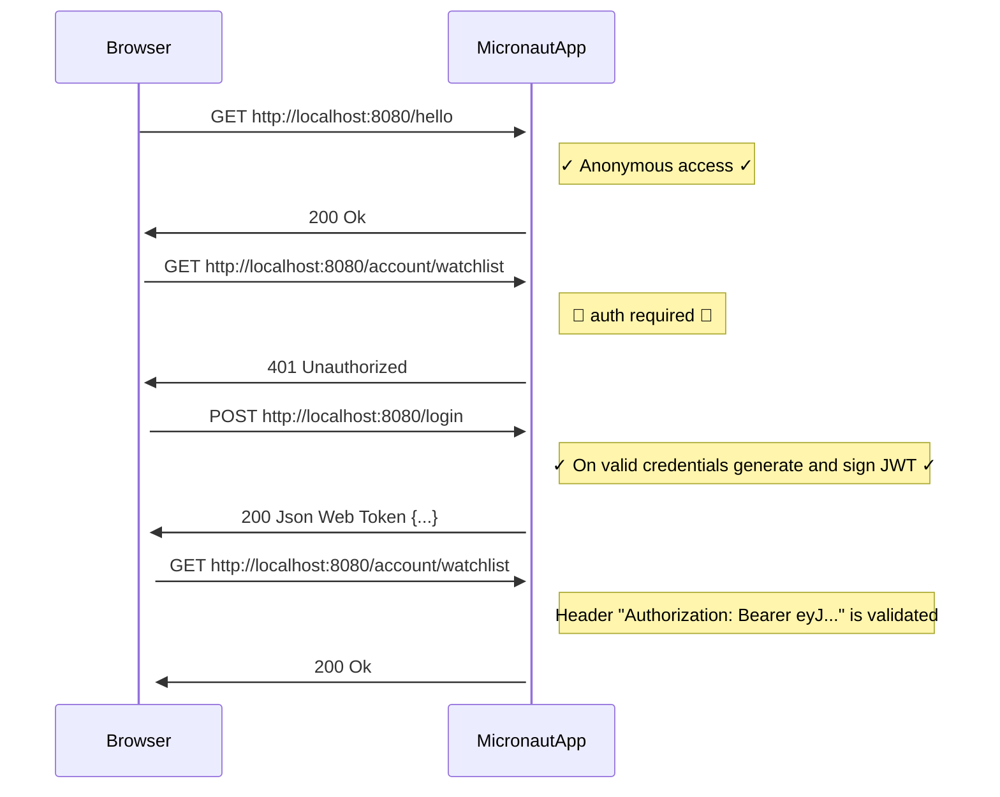

```mermaid
sequenceDiagram
	Browser->>+MicronautApp: GET http://localhost:8080/hello
  Note right of MicronautApp: ✓ Anonymous access ✓
	MicronautApp->>+Browser: 200 Ok
  Browser->>+MicronautApp: GET http://localhost:8080/account/watchlist
  Note right of MicronautApp: 🔐 auth required 🔐
  MicronautApp->>+Browser: 401 Unauthorized
  Browser->>+MicronautApp: POST http://localhost:8080/login
  Note right of MicronautApp: ✓ On valid credentials generate and sign JWT ✓
  MicronautApp->>+Browser: 200 Json Web Token {...}
  Browser->>+MicronautApp: GET http://localhost:8080/account/watchlist
  Note right of MicronautApp: Header "Authorization: Bearer eyJ..." is validated
	MicronautApp->>+Browser: 200 Ok
```
